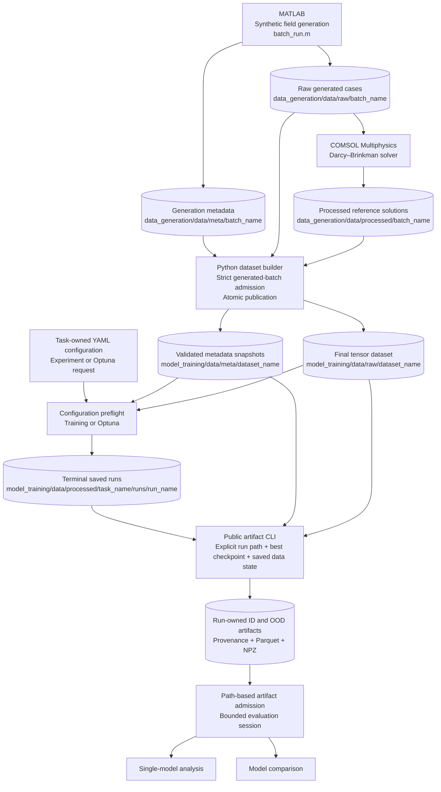
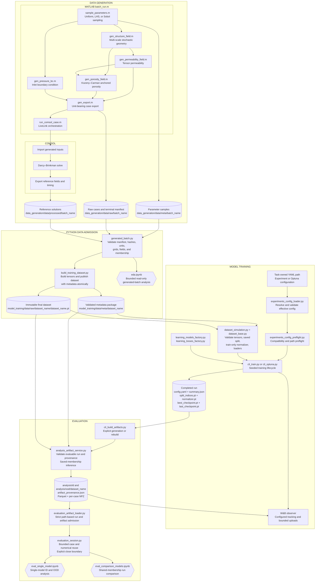

# GrainLegumes-PINO-Airflow: Physics-Informed Neural Operators for Porous Media Flow
### *Specialization Project 1 (VP1) – MSE Data Science, Autumn 2025*

**Master of Science in Engineering – Major Data Science**  
**Eastern Switzerland University of Applied Sciences (OST)**  
**Author:** Rino M. Albertin  
**Supervisor:** Prof. Dr. Christoph Würsch  

> **Follow-up project:**  
> [GrainLegumes-PINO-Drying](https://github.com/Rinovative/grainlegumes-pino-drying) extends this steady-airflow foundation to transient coupled heat and moisture transport.

## 📌 Project Overview

This specialization project studies the learning of physically consistent surrogate models for steady, incompressible airflow air flow through **heterogeneous porous granular** media using **Physics-Informed Neural Operators (PINOs)**.

High-fidelity permeability and porosity fields are synthetically generated in **MATLAB** and simulated with **COMSOL Multiphysics** using a Darcy–Brinkman formulation.  
The central objective is to train two-dimensional neural operators that learn the operator mapping

  **(κ, ε, p_bc) → (p, u, v)**

from spatially varying permeability tensors κ, porosity fields ε, and inlet pressure boundary conditions p_bc to pressure and velocity fields, while explicitly enforcing physical consistency through PDE-based constraints.

The repository provides a complete, modular research pipeline covering:

<details>
<summary><strong>🧩 Data generation  </strong></summary>

A fully automated MATLAB-driven pipeline for synthetic porous-media data generation, including:
- **Parameter sampling**: space-filling sampling strategies (uniform, LHS, Sobol)
- **Structure synthesis**: stochastic multi-scale structure field generation as latent geometric backbone
- **Permeability construction**: physically consistent mapping to scalar and tensor-valued permeability fields
- **Porosity modelling**: independent porosity field generation with global Kozeny–Carman level anchoring
- **Boundary conditions**: low-dimensional, spatially varying inlet pressure boundary conditions
- **High-fidelity simulation**: batch-controlled Darcy–Brinkman simulations in COMSOL via LiveLink for MATLAB
The pipeline supports resume-safe batch execution, reproducible seeding, and rich data export (CSV + JSON).
</details>


<details>
<summary><strong>📊 Exploratory Data Analysis (EDA)</strong></summary>

An interactive EDA framework including:
- **Statistical analysis**: case-level distributions of generator parameters, meta statistics, and reduced field statistics (min/mean/max)
- **Spectral analysis**: two-dimensional FFT-based analysis
- **Scale diagnostics**: isotropic radial energy spectra and vertical spectral evolution analysis
</details>


<details>
<summary><strong>⚙️ Neural Operator training (FNO / U-NO / PINOs)  </strong></summary>

A modular, seeded training framework for neural operator models, including:
- **Architectures**: FNO, U-NO, and physics-informed variants (PI-FNO, PI-U-NO)
- **Multi-field I/O**: spatial coordinates, tensor-valued permeability, porosity, inlet pressure → velocity components and pressure
- **Physics-informed learning**: COMSOL-consistent Brinkman PINO loss combining data fidelity and PDE residuals
- **Spectral diagnostics**: optional non-intrusive forward hooks on spectral convolution layers
- **Experiment tracking**: structured local and W&B logging with resolved model, optimizer, scheduler, loss, seed, device, and deterministic-algorithm settings
- **Reproducibility**: stable labelled seeds for Python, NumPy, PyTorch, data loading, workers, splitting, and tuning, with explicit per-configuration deterministic-algorithm policy
- **Hyperparameter optimization**: Optuna studies resolved through the same task, configuration, data, run, and tracking contracts as direct training
- **Selection objective**: task-owned `normalized_group_macro_rmse`, a dimensionless lower-is-better macro mean over physical output groups
</details>


<details>
<summary><strong>🧪 Evaluation</strong></summary>

An evaluation suite for systematic single-run assessment, cross-run comparison on shared memberships, and ID/OOD analysis, including:
- **Run-owned artifacts**: versioned provenance, payload digests, saved membership, normalized diagnostics, physical squared-error/count sufficient statistics, per-case arrays, physics residuals, and optional runtime comparison
- **Portable evaluation notebooks**: explicit current run-directory selection, strict completed or provisional terminal-run admission, reuse of valid artifacts, and local CPU generation of missing roles without silent incompatible-cache rebuilds
- **Performance and field fidelity**: authoritative grouped-objective summaries, predictive-error distributions, mean fields, spatial error statistics, bias, and output spectra
- **Error drivers and physical consistency**: target-magnitude, boundary-distance, metadata, Darcy–Brinkman residual, continuity, and pressure-boundary diagnostics
- **Cases and extremes**: shared-case inspection, permeability overlays, outlier tables, worst-case fields, and extreme-input views
- **Model trade-offs**: comparison-only accuracy–physics and exact parameter-count analyses
</details>


🧬 **Interactive research environment**  
Evaluation panels expose distinct single-model and comparison compositions. Every visible tab offers multiple scientific views, renders only the selected figure, and exports only that figure. An explicit bounded session reuses validated immutable case data and numerical reductions until it is closed, while presentation-only changes do not reopen unchanged NPZ payloads.

## 📄 Project Report

Full project report, including methodology, model formulation, and detailed evaluation results:
[Albertin_2026_PINO_Airflow_PorousMedia.pdf](docs/Albertin_2026_PINO_Airflow_PorousMedia.pdf)

## 📊 Visualization

### Qualitative model comparison

<p align="center">
  
</p>

<p align="center">
<em>
Representative qualitative comparison of pressure-field predictions on a challenging outlier case for supervised and physics-informed neural-operator variants against the CFD reference solution. The figure illustrates differences in large-scale pressure structure, local deviations and physical consistency between FNO, U-NO and their physics-informed variants.
</em>
</p>

### Outlier-case inspection

<p align="center">
  
</p>

<p align="center">
<em>
Evaluation of the best-performing model (PI-U-NO with physics-informed loss) on a challenging outlier case.
</em>
</p>

## 🧭 Data Flow Overview

<details>
<summary><strong>High-Level System Overview (Tools and Data Flow)</strong></summary>


</details>

<details>
<summary><strong>Detailed Pipeline Architecture (Data Generation, Training, Evaluation)</strong></summary>


</details>

## ⚙️ Local Execution

<details>
<summary><strong>Run via Docker</strong></summary>

### Requirements

Install Git, Docker with Docker Compose, and Visual Studio Code with the
**Dev Containers** extension. NVIDIA Container Toolkit is also required for GPU
jobs.

### Recommended: Dev Container

Clone the repository, build the maintained image, and start the development
container:

~~~bash
git clone https://github.com/Rinovative/grainlegumes-pino-airflow.git
cd grainlegumes-pino-airflow
./scripts/docker_build.sh
./scripts/docker_dev.sh
~~~

In Visual Studio Code, open **Remote Explorer -> Dev Containers**, attach to
**grainlegumes-pino-airflow-dev**, and open **/workspace/repo**.

To enter the running container from a terminal instead:

~~~bash
docker exec -it grainlegumes-pino-airflow-dev bash
~~~

### Storage

**STORAGE_ROOT** selects the host storage directory and defaults to the sibling
**../storage** directory. Set it before starting the container when using another
location:

~~~bash
export STORAGE_ROOT=/absolute/path/to/storage
~~~

The maintained mounts are:

~~~text
$STORAGE_ROOT/data_generation -> /workspace/repo/data_generation/data
$STORAGE_ROOT/data_training   -> /workspace/repo/model_training/data
~~~

**data_generation** is mounted read-only. **data_training** is mounted read-write.

### Train, tune, and publish artifacts

Run the host job wrapper from the repository root:

~~~bash
./scripts/docker_job.sh train experiment.yaml
./scripts/docker_job.sh train experiment.yaml --no-build-artifacts
./scripts/docker_job.sh optuna <optuna_config> [Optuna options...]
./scripts/docker_job.sh artifacts (--task TASK | --runs-root PATH | --run-dir RUN_DIR) [artifact options...]
~~~

Normal direct training publishes the completed run and then generates missing or
reuses valid ID and configured OOD artifacts inside that run bundle. This stage
runs in the same queued container on the same selected physical GPU. The
**--no-build-artifacts** flag skips only this post-training stage. Optuna trials do not build full artifacts automatically.

Non-interactive submissions must include **--queue-gpu auto** or
**--queue-gpu INDEX**. Interactive submissions may select a reported GPU at the
prompt.

### Portable evaluation notebooks

Use:

- model_training/notebooks/eval_single_model.ipynb
- model_training/notebooks/eval_comparison_models.ipynb

Both notebooks default to the conventional processed-data `<task>/runs` parent and compose each current run directory from an editable runs root plus `RUN_NAME`. `RUN_NAME` is the directory leaf or storage alias; the immutable scientific run name is read from `config.yaml` and `summary.json`. Change the root independently for moved collections, or set it to an Optuna study's `trials/` parent. The composed directory is passed to the portable path-based workflow.

Valid artifacts are loaded without reconstructing a model or running inference. Missing selected roles are generated atomically and locally on CPU by default. Partial, corrupt, stale, or incompatible targets fail without replacement unless the visible rebuild option is explicitly enabled. Notebook-triggered generation does not contact W&B. Complete run bundles and their relative-path artifacts remain usable after a rename or move; valid non-completed terminal runs remain visibly provisional.

</details>

## 📂 Repository Structure
<details>
<summary><strong>Show project tree</strong></summary>

```bash
.
├── .github
│   └── workflows
│       └── quality.yml                                             # Maintained quality checks
│ 
├── data_generation                                                 # Generated-data domain and dataset publication
│   ├── comsol
│   │   └── template_brinkman.mph                                   # Darcy–Brinkman COMSOL model template
│   │
│   ├── data                                                        # GENERATED_DATA_ROOT mount target
│   │   ├── meta
│   │   │   ├── <batch_name>.csv                                    # Sampled batch parameters
│   │   │   └── <batch_name>.json                                   # Batch sampling configuration
│   │   │
│   │   ├── processed
│   │   │   └── <batch_name>
│   │   │       └── case_0001_sol.csv                               # Unit-bearing COMSOL reference fields
│   │   │
│   │   └── raw
│   │       └── <batch_name>
│   │           ├── batch_manifest.json                             # Terminal generated-batch identity and membership
│   │           ├── case_0001.csv                                   # Generated permeability, porosity, and boundary fields
│   │           └── case_0001.json                                  # Case generation metadata
│   │
│   ├── matlab                                                      # MATLAB field generation and COMSOL coupling
│   │   ├── functions
│   │   │   ├── core
│   │   │   │   ├── gen
│   │   │   │   │   ├── gen_export.m                                # Case export
│   │   │   │   │   ├── gen_permeability_field.m                    # Tensor permeability generation
│   │   │   │   │   ├── gen_porosity_field.m                        # Porosity generation
│   │   │   │   │   ├── gen_pressure_bc.m                           # Inlet-pressure generation
│   │   │   │   │   └── gen_structure_field.m                       # Stochastic structure generation
│   │   │   │   │
│   │   │   │   ├── gen_simulation_inputs.m                         # Simulation-input assembly
│   │   │   │   ├── run_comsol_case.m                               # One COMSOL solve
│   │   │   │   └── sample_parameters.m                             # Design-of-experiments sampling
│   │   │   │
│   │   │   └── test                                                # MATLAB contract tests
│   │   │
│   │   └── batch_run.m                                             # Resume-safe batch orchestration
│   │
│   ├── build_training_dataset.py                                   # Atomic final-dataset and metadata publication
│   └── generated_batch.py                                          # Strict read-only generated-batch admission
│
├── docs
│   ├── figures                                                     # README figures
│   └── Albertin_2026_PINO_Airflow_PorousMedia.pdf                  # Project report
│
├── model_training                                                  # Task, training, artifact, and analysis package
│   ├── configs
│   │   └── tasks
│   │       └── <task>
│   │           ├── experiments
│   │           │   └── <category>
│   │           │       └── <experiment_config>.yaml                # Direct-training request
│   │           │ 
│   │           └── optuna
│   │               └── <optuna_config>.yaml                        # Optuna study request
│   │
│   ├── data                                                        # MODEL_TRAINING_DATA_ROOT mount target
│   │   ├── meta
│   │   │   └── <dataset_name>
│   │   │       ├── dataset_metadata.json                           # Validated dataset identity and payload digest
│   │   │       ├── source_manifest.json                            # Admitted generation-manifest snapshot
│   │   │       ├── source_sample.csv                               # Admitted sampled-parameter table
│   │   │       └── source_sample.json                              # Admitted sampling snapshot
│   │   │
│   │   ├── processed
│   │   │   └── <task>
│   │   │       ├── logs
│   │   │       │   └── queue                                       # Host-visible detached worker logs
│   │   │       ├── runs
│   │   │       │   └── <run_name>
│   │   │       │       ├── analysis
│   │   │       │       │   ├── id
│   │   │       │       │   │   ├── npz
│   │   │       │       │   │   │   └── case_0001.npz               # Prediction, reference, input, and residual arrays
│   │   │       │       │   │   ├── artifact_provenance.json        # Versioned identity and payload manifest
│   │   │       │       │   │   └── <dataset_name>.parquet          # Per-case metrics and aggregate evidence
│   │   │       │       │   │
│   │   │       │       │   └── ood
│   │   │       │       │       └── <dataset_name>                  # OOD role with the same artifact contract
│   │   │       │       │
│   │   │       │       ├── best_checkpoint.pt                      # Selected inference and artifact checkpoint
│   │   │       │       ├── config.yaml                             # Resolved immutable run configuration
│   │   │       │       ├── last_checkpoint.pt                      # Exact resume checkpoint
│   │   │       │       ├── normalizer.pt                           # Train-membership-fitted normalizer
│   │   │       │       ├── split_indices.pt                        # Saved train, ID evaluation, and OOD membership
│   │   │       │       └── summary.json                            # Lifecycle, identity, and selected metrics
│   │   │       │
│   │   │       └── studies
│   │   │           └── <study_name>                                # Persistent Optuna study and trial runs
│   │   │
│   │   └── raw
│   │       └── <dataset_name>
│   │           └── <dataset_name>.pt                               # Immutable final tensor dataset
│   │
│   ├── notebooks
│   │   ├── eda.ipynb                                               # Bounded generated-batch exploration
│   │   ├── eval_comparison_models.ipynb                            # Path-based shared-membership run comparison
│   │   ├── eval_single_model.ipynb                                 # Path-based single-run ID/OOD evaluation
│   │   └── training_pipeline.ipynb                                 # Read-only configuration and workflow control plane
│   │
│   ├── src
│   │   ├── analysis
│   │   │   ├── artifacts
│   │   │   │   ├── __init__.py
│   │   │   │   ├── analysis_artifact_contracts.py                  # Versioned artifact schemas, digests, and aggregates
│   │   │   │   ├── analysis_artifact_generation.py                 # Per-case inference artifact generation
│   │   │   │   ├── analysis_artifact_service.py                    # Evaluable-run artifact orchestration and publication
│   │   │   │   └── analysis_artifact_timing.py                     # COMSOL and neural runtime sidecars
│   │   │   │
│   │   │   ├── eda
│   │   │   │   ├── plots
│   │   │   │   │   ├── __init__.py
│   │   │   │   │   ├── eda_plot_case_statistics.py                 # Case metadata and field-statistic plots
│   │   │   │   │   └── eda_plot_spectral_analysis.py               # Isotropic, directional, and evolving spectra
│   │   │   │   │
│   │   │   │   ├── __init__.py
│   │   │   │   ├── eda_dataframe.py                                # Strict generated-batch EDA frames
│   │   │   │   └── eda_panel.py                                    # Lazy interactive EDA panel
│   │   │   │
│   │   │   ├── evaluation
│   │   │   │   ├── evaluation_plot
│   │   │   │   │   ├── __init__.py
│   │   │   │   │   ├── evaluation_plot_error_behavior.py           # Predictive-error and field-fidelity plots
│   │   │   │   │   ├── evaluation_plot_physical_consistency.py     # Residual and pressure-boundary diagnostics
│   │   │   │   │   ├── evaluation_plot_run_summary.py              # Run summaries and accuracy-physics trade-offs
│   │   │   │   │   ├── evaluation_plot_samples_outliers.py         # Case, outlier, and extreme-input views
│   │   │   │   │   ├── evaluation_plot_sensitivity_capacity.py     # Metadata sensitivity and model capacity plots
│   │   │   │   │   └── evaluation_plot_spectral_fidelity.py        # Output-spectrum and transfer diagnostics
│   │   │   │   │
│   │   │   │   ├── __init__.py
│   │   │   │   ├── evaluation_artifact_loader.py                   # Strict path-based evaluable-run artifact admission
│   │   │   │   ├── evaluation_case.py                              # Validated per-case NPZ access
│   │   │   │   ├── evaluation_dataframe.py                         # Artifact tables and comparison contracts
│   │   │   │   ├── evaluation_panel.py                             # Lazy single-model and comparison panels
│   │   │   │   └── evaluation_session.py                           # Bounded case and numerical reuse session
│   │   │   │
│   │   │   ├── presentation
│   │   │   │   ├── __init__.py
│   │   │   │   ├── analysis_presentation_curated.py                # Curated non-interactive analysis bundle
│   │   │   │   └── analysis_presentation_registry.py               # Ordered section and plot presentation metadata
│   │   │   │
│   │   │   ├── ui
│   │   │   │   ├── __init__.py
│   │   │   │   ├── analysis_ui_components.py                       # Shared notebook widget components
│   │   │   │   ├── analysis_ui_notebook.py                         # Notebook panel and selected-export composition
│   │   │   │   └── analysis_ui_viewers.py                          # Lazy controlled figure viewers
│   │   │   └── __init__.py
│   │   │
│   │   ├── common
│   │   │   ├── __init__.py
│   │   │   ├── common_locking.py                                   # Advisory file-lock helpers
│   │   │   ├── common_paths.py                                     # Data-domain, run, study, and artifact paths
│   │   │   └── common_serialization.py                             # Atomic JSON and binary serialization
│   │   │
│   │   ├── datasets
│   │   │   ├── dataset_modules
│   │   │   │   ├── __init__.py
│   │   │   │   └── dataset_module_flow.py                          # Task-ordered flow tensor validation
│   │   │   │
│   │   │   ├── __init__.py
│   │   │   ├── dataset_base.py                                     # Splits, normalizers, and dataloaders
│   │   │   ├── dataset_identity.py                                 # Immutable final-dataset identity
│   │   │   ├── dataset_metadata.py                                 # Validated dataset metadata packages
│   │   │   └── dataset_simulation.py                               # Final simulation-dataset loader
│   │   │
│   │   ├── domain
│   │   │   ├── physics
│   │   │   │   ├── __init__.py
│   │   │   │   ├── domain_physics_boundary.py                      # Pressure-boundary diagnostics
│   │   │   │   ├── domain_physics_brinkman.py                      # Darcy–Brinkman residual operators
│   │   │   │   ├── domain_physics_contracts.py                     # Physics and continuity contracts
│   │   │   │   └── domain_physics_derivatives.py                   # Finite-difference and spectral derivatives
│   │   │   │
│   │   │   ├── tasks
│   │   │   │   ├── __init__.py
│   │   │   │   ├── domain_task_registry.py                         # Registered task lookup
│   │   │   │   ├── domain_task_spec.py                             # Immutable task scientific contract
│   │   │   │   └── domain_task_steady_flow.py                      # Steady-flow task definition
│   │   │   │
│   │   │   ├── __init__.py
│   │   │   ├── domain_field_sets.py                                # Task field-set composition
│   │   │   ├── domain_fields.py                                    # Physical field specifications
│   │   │   └── domain_permeability.py                              # Permeability representation transforms
│   │   │
│   │   ├── experiments
│   │   │   ├── cli
│   │   │   │   ├── __init__.py
│   │   │   │   ├── cli_build_artifacts.py                          # Artifact-generation command line
│   │   │   │   ├── cli_config_preflight.py                         # Configuration-preflight command line
│   │   │   │   ├── cli_device.py                                   # Shared device-policy arguments
│   │   │   │   ├── cli_optuna.py                                   # Optuna-study command line
│   │   │   │   └── cli_train.py                                    # Direct-training command line
│   │   │   │
│   │   │   ├── config
│   │   │   │   ├── __init__.py
│   │   │   │   ├── experiments_config_defaults.py                  # Default effective configuration values
│   │   │   │   ├── experiments_config_loader.py                    # YAML resolution and semantic validation
│   │   │   │   └── experiments_config_preflight.py                 # Workflow-family configuration preflight
│   │   │   │
│   │   │   ├── tuning
│   │   │   │   ├── __init__.py
│   │   │   │   ├── experiments_tuning_optuna.py                    # Optuna study and trial lifecycle
│   │   │   │   └── experiments_tuning_search_space.py              # Validated hyperparameter sampling
│   │   │   │
│   │   │   ├── validation
│   │   │   │   ├── __init__.py
│   │   │   │   └── experiments_validation_data_pipeline.py         # Full mounted-data pipeline validation
│   │   │   │
│   │   │   ├── __init__.py
│   │   │   ├── experiments_console.py                              # Structured lifecycle console reporting
│   │   │   ├── experiments_notebook_support.py                     # Read-only training-notebook presentation
│   │   │   ├── experiments_run.py                                  # Seeded saved-run lifecycle and resume
│   │   │   └── experiments_tracking.py                             # W&B observer and upload policy
│   │   │
│   │   ├── learning
│   │   │   ├── inference
│   │   │   │   ├── __init__.py
│   │   │   │   └── learning_inference.py                           # Saved-run inference reconstruction
│   │   │   │
│   │   │   ├── losses
│   │   │   │   ├── __init__.py
│   │   │   │   ├── learning_losses_factory.py                      # Task-aware loss construction
│   │   │   │   └── learning_losses_pino.py                         # Physics-informed loss composition
│   │   │   │
│   │   │   ├── metrics
│   │   │   │   ├── __init__.py
│   │   │   │   └── learning_metrics.py                             # Predictive and physical evaluation metrics
│   │   │   │
│   │   │   ├── models
│   │   │   │   ├── __init__.py
│   │   │   │   └── learning_models_factory.py                      # FNO and UNO model construction
│   │   │   │
│   │   │   ├── training
│   │   │   │   ├── __init__.py
│   │   │   │   ├── learning_training_checkpoint.py                 # Checkpoint state and resume validation
│   │   │   │   ├── learning_training_events.py                     # Evaluation and checkpoint event schedules
│   │   │   │   ├── learning_training_loop.py                       # Training, evaluation, and selection loop
│   │   │   │   └── learning_training_optim.py                      # Optimizer and scheduler construction
│   │   │   │
│   │   │   ├── __init__.py
│   │   │   ├── learning_device.py                                  # Concrete CPU and CUDA resolution
│   │   │   └── learning_device_policy.py                           # Static device-policy validation
│   │   └── __init__.py
│   │
│   └── tests                                                       # Unit, contract, integration, and real-data acceptance tests
│ 
├── scripts
│   ├── check_notebooks.py                                          # Notebook JSON and code-cell validation
│   ├── config_preflight_runtime.py                                 # Isolated host-wrapper preflight
│   ├── docker_build.sh                                             # Maintained image build
│   ├── docker_dev.sh                                               # Development-container mounts and startup
│   └── docker_job.sh                                               # Generic train, Optuna, and artifact queue wrapper
│ 
├── .dockerignore                                                   # Excluded files from the Docker build context
├── .gitignore                                                      # Files excluded from version control
├── Dockerfile                                                      # CUDA/micromamba project image
├── LICENSE.md                                                      # Apache License 2.0
├── README.md                                                       # Project overview and workflow documentation
├── environment-dev.yml                                             # Development additions
├── environment.yml                                                 # Runtime dependencies
├── pyproject.toml                                                  # Package and quality-tool configuration
└── setup.py                                                        # Multi-root package discovery
```
</details>

## 📄 License

This project is released under the [Apache License 2.0](LICENSE.md).

## 📚 Reference

Kossaifi, J., Kovachki, N., Li, Z., Pitt, D., Liu-Schiaffini, M., Duruisseaux, V., George, R. J., Bonev, B., Azizzadenesheli, K., Berner, J., & Anandkumar, A. (2025).  
*A Library for Learning Neural Operators.*  
*arXiv preprint* [arXiv:2412.10354](https://arxiv.org/abs/2412.10354)